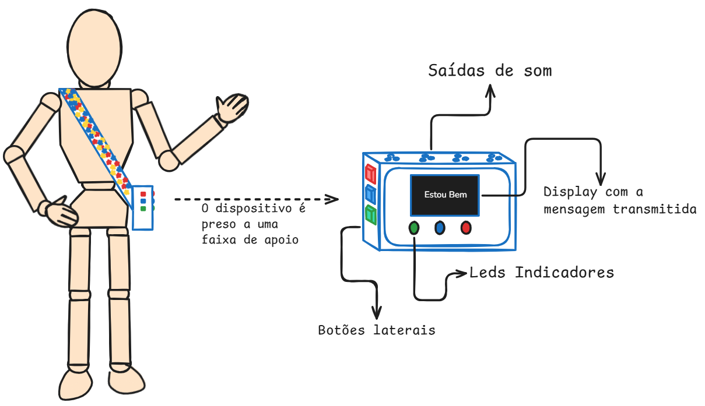
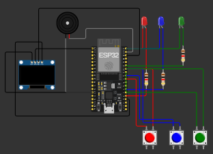

# Processo Seletivo – Intensivo Maker | IoT
## Etapa Prática – Sistemas Embarcados

**Relatório do Projeto – Sistema Embarcado Assistivo**

Identificação do Candidato: Raissa Karoliny da Silva Rodrigues

## 1️⃣ Visão Geral da Solução

Este projeto tem como objetivo desenvolver um sistema embarcado assistivo para auxiliar pessoas autistas não verbais na comunicação de necessidades básicas.

O sistema simulado consiste em um dispositivo com botões físicos, onde cada botão representa uma ação ou necessidade específica, como “estou com fome”, “quero água” ou “preciso de ajuda”. Ao pressionar um botão, o dispositivo emite um som correspondente e ativa um LED indicador, fornecendo feedback auditivo e visual.(Segue abaixo uma imagem do protótipo)

## 2️⃣ Arquitetura do Sistema Embarcado

 **Bibliotecas Utilizadas**

- machine → controle de pinos (GPIO) e PWM  
- time → controle de temporização (sleep) 
- micropython → para ajudar com o display
- framebuf → para ajudar com o display

O sistema segue uma estrutura baseada na interação entre botões, LEDs, emissão de som e visualização de mensagens em um display.

**Fluxo principal do programa (main.py)**

O programa inicia configurando os componentes (Display, LEDs, botões e buzzer) e executa um modo de teste automático que simula as interações do usuário.

Para cada ação:
- Uma mensagem é exibida no display  
- Um som específico é emitido  
- Um LED correspondente é acionado  
- Uma mensagem é exibida no terminal  

| LED      | Cor   | Significado                              |
|----------|-------|------------------------------------------|
| Azul     | 🔵    | Quero ir ao banheiro.                    |
| Amarelo  | 🟢    | estou bem.                               |
| Vermelho | 🔴    | Preciso de ajuda.                        |

**Estrutura de funcionamento**

Cada ação do sistema é separada em funções (acao_banheiro, acao_ajuda, acao_ok), que reutilizam funções auxiliares:

Funções de som (som_curto, som_longo, som_urgente)
Função de controle dos LEDs (acionar)
Função de para mostrar mensagem no display (mostrar_mensagem)

**Temporização**

São utilizados pequenos intervalos (sleep) para controlar o tempo dos sons e o piscar dos LEDs,

**Interação entre componentes**

Botão pressionado → Processamento no código → Mensagem no display → Emissão de som → Ativação de LED  

## 3️⃣ Componentes Utilizados na Simulação
| Componente        | Função                                                                 |
|------------------|------------------------------------------------------------------------|
| ESP32            | Microcontrolador responsável pelo controle do sistema                  |
| Display          | Responsável por printar o texto das ações                              |
| Botões           | Cada botão representa uma necessidade específica                       |
| LEDs             | Indicação visual da ação executada, cada LED pode representar uma função associada |
| Buzzer           | Responsável pela emissão de áudio; simula mensagens como “fome”, “água”, etc. |

## 4️⃣ Decisões Técnicas Relevantes
O código foi organizado em funções. Por exemplo, desligar_todos() é responsável por apagar todos os LEDs; acionar(led) recebe como parâmetro o LED a ser ativado e realiza seu acionamento; e acao_banheiro() chama a função acionar(led) junto com som_curto(), utilizando o LED e o som correspondentes à ação. A modularização do código foi adotada para facilitar futuras modificações e a adição de novas funcionalidades.

Vale ressaltar que, por se tratar de uma simulação, os botões não estão sendo utilizados diretamente. As ações do sistema são executadas por meio de chamadas às funções dentro da função de teste (modo_teste), responsável por simular o comportamento do dispositivo.

## 5️⃣ Resultados Obtidos
O sistema exibe no display a mensagem correspondente à ação, aciona o LED e emite o som associado, de acordo com o botão pressionado, atendendo plenamente ao objetivo proposto pela minha solução.

## 6️⃣ Comentários Adicionais
 O arquivo ci.yml foi alterado para:
 " path: .
   expect_text: 'SIMULACAO_OK'"
no intuito de finalizar a simulação quando encontra o 'SIMULACAO_OK'.

**Dificuldades encontradas**
- Definir a problemática que o sistema iria resolver.
- Simular as funções em um curto espaço de tempo, por conta do actions;
- Importar biblioteca para usar o display, então coloquei no proprio código main.py as funções de display.

**Limitações**
- Sons representados de forma simplificada (buzzer)
- Número limitado de botões/funções

**Melhorias futuras**
- Implementação de áudio real com arquivos gravados
- Integração com aplicativos móveis
- Personalização das mensagens

Aprendizados:
- Git actions, plataforma wokwi.

Para mais informações entre em contato comigo: raissateixeir4@gmail.com
